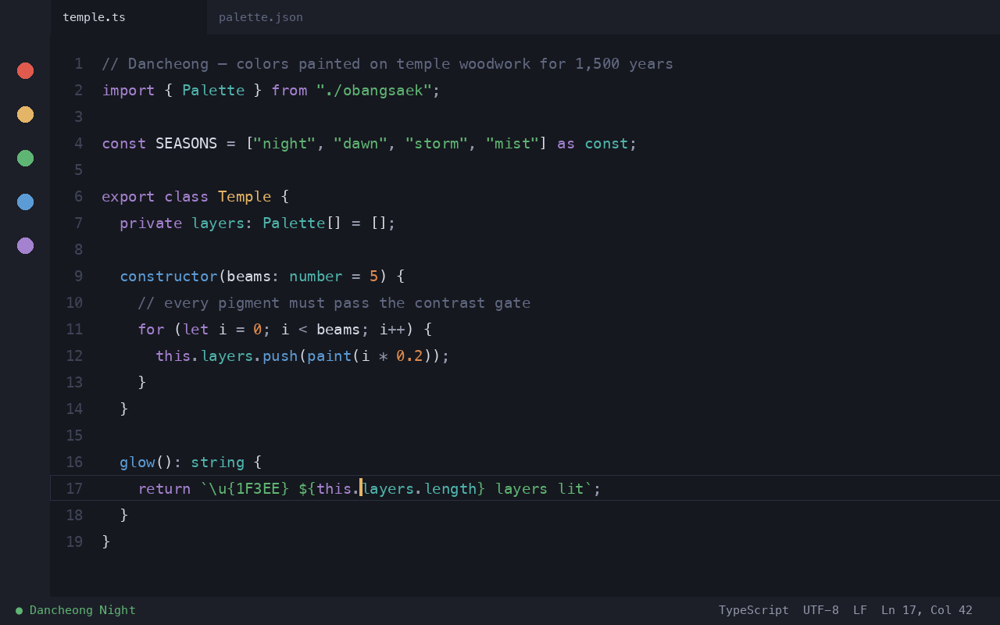
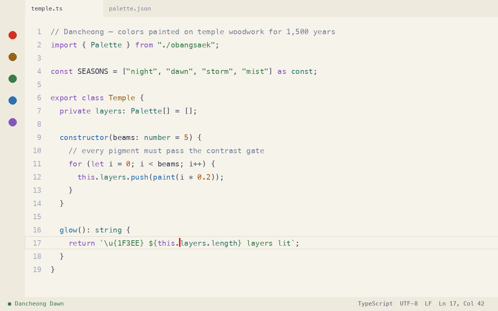
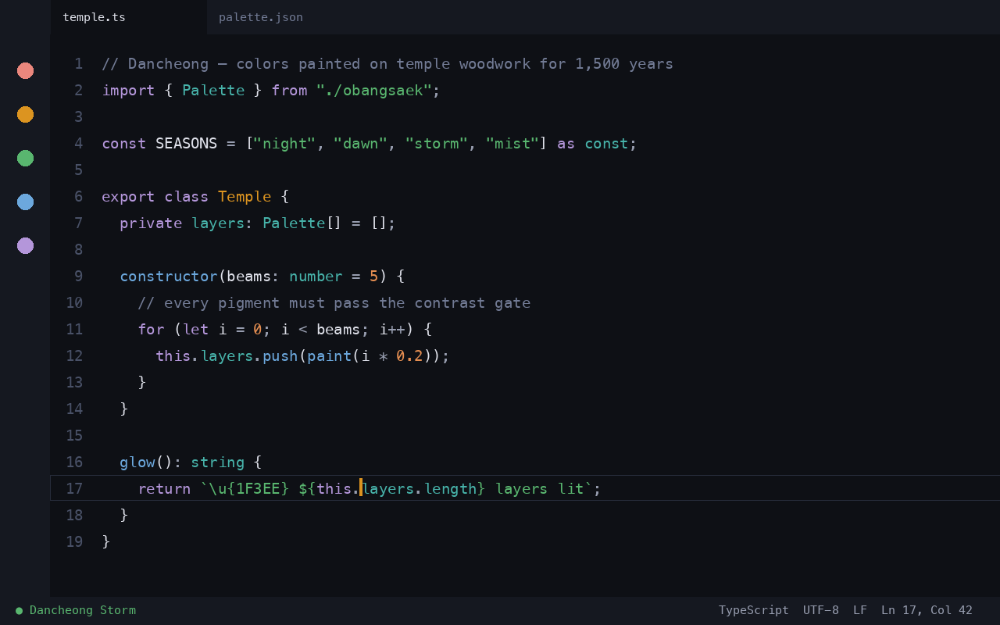
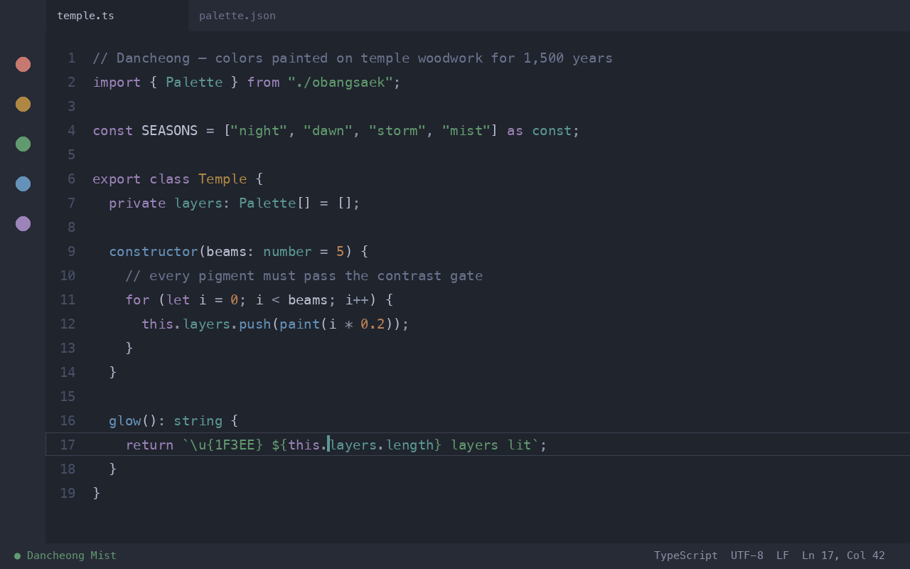

  

<h1 align="center">Dancheong</h1>

  Color themes drawn from <b>dancheong</b> (단청) — the mineral pigment palette
  Korean artisans have painted on temple and palace woodwork for 1,500 years. 
  Deep indigo beams, cinnabar red, ochre gold, verdigris green — tuned for code.

---

## Four variants

| Theme | Mood | Body text contrast |
|---|---|---|
| **Dancheong Night** | The flagship dark — indigo beams at dusk | 12.7 : 1 |
| **Dancheong Dawn** | Light — warm *hanji* paper, ink, and pigment | 9.6 : 1 |
| **Dancheong Storm** | High contrast dark — every accent ≥ 7.5 : 1 | 14.6 : 1 |
| **Dancheong Mist** | Muted dark — desaturated, for long sessions | 8.5 : 1 |

### Night

### Dawn

### Storm

### Mist

## Why another theme?

Most themes are tuned by eye. Dancheong is **tuned by a build pipeline**:
every foreground color is generated against its background to hit a WCAG
contrast target, and the build *fails* if any pair falls below the gate
(7:1 body text, 4.5:1 accents, 3:1 comments). The palette is one JSON file;
every port is generated from it, so all apps match exactly.

Colors aren't decoration here. Contrast is why your eyes last through
a six-hour session.

## Install

**VS Code**: search `Dancheong` in the Extensions panel, or
`ext install dancheong.dancheong-theme` — then `⌘K ⌘T` and pick a variant.

**iTerm2 / Alacritty**: free ports live in [`extras/`](extras/) —
import the `.itermcolors` file, or drop the `.toml` into your Alacritty config.

## Dancheong PRO

The full pigment set, for every tool you stare at:

- **9+ apps today**: VS Code, iTerm2, Alacritty, Kitty, Ghostty,
  Windows Terminal, Warp, tmux, Zed — with JetBrains, Neovim, Sublime,
  Obsidian and more rolling out to the same palette
- All four variants everywhere, byte-identical colors
- Lifetime updates — new apps and variants included

**[Get Dancheong PRO on Gumroad →](https://dancheong.gumroad.com/l/dancheong-pro)**

## The five colors

Obangsaek (오방색) — the five cardinal colors of Korean cosmology — anchor the
palette: blue (east), red (south), yellow (center), white (west), black (north).
Dancheong pigments were ground from minerals, which is why they read muted yet
vivid: real rocks, not neon. This theme keeps that quality — saturated enough
to separate tokens, calm enough to live in.

## License

MIT — the free themes in this repo are yours to use and modify.
